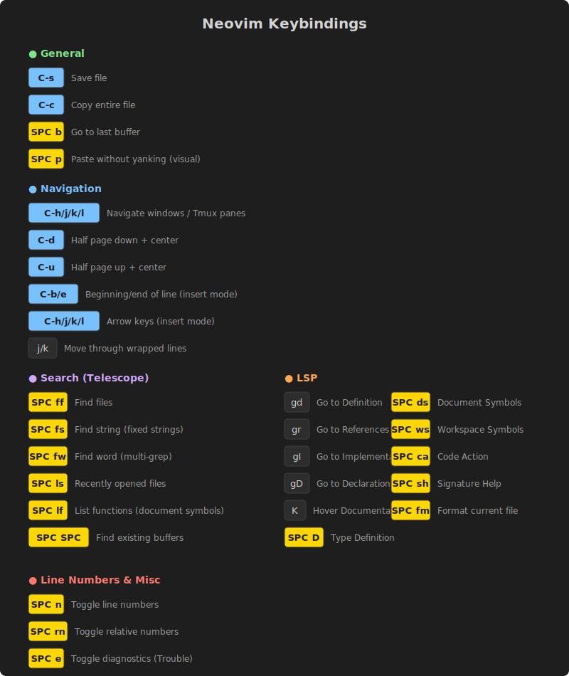

# Neovim Configuration

Personal Neovim configuration with custom keybindings for efficient navigation, search, and LSP integration.

---

## ⌨️ Keybinding Legend

Before diving into the shortcuts, here's how to read the key notation used in this documentation:

| Notation | Meaning | Description |
|----------|---------|-------------|
| `<leader>` | **Space** | The leader key is set to `Space`. Press it before the next key in sequences like `<leader>ff`. |
| `<C-x>` | **Ctrl + x** | Hold Ctrl and press the key. For example, `<C-s>` means Ctrl+S to save. |
| `<C-h/j/k/l>` | **Ctrl + Direction** | Arrow key equivalents: h=left, j=down, k=up, l=right. |
| `SPC` | **Space** | Visual abbreviation for the leader key in diagrams. |

---

## 🎨 Keybindings Visual Reference



---

## 📋 Quick Reference

### General
| Key | Action |
|-----|--------|
| `<C-s>` | Save file |
| `<C-c>` | Copy entire file content |
| `<leader>b` | Go to last buffer |
| `<leader>p` | Paste without yanking (visual mode) |

### Navigation
| Key | Action |
|-----|--------|
| `<C-h/j/k/l>` | Navigate between windows / Tmux panes |
| `<C-d>` | Half page down + center cursor |
| `<C-u>` | Half page up + center cursor |
| `<C-b>` (insert) | Go to beginning of line |
| `<C-e>` (insert) | Go to end of line |
| `<C-h/j/k/l>` (insert) | Arrow keys in insert mode |
| `j/k` | Move through wrapped lines |

### Search (Telescope)
| Key | Action |
|-----|--------|
| `<leader>ff` | Find files |
| `<leader>fs` | Find string (fixed strings) |
| `<leader>fw` | Find word (multi-grep with pattern) |
| `<leader>ls` | Recently opened files |
| `<leader>lf` | List functions (document symbols) |
| `<leader><space>` | Find existing buffers |

### LSP (Language Server Protocol)
| Key | Action |
|-----|--------|
| `gd` | Go to Definition |
| `gr` | Go to References |
| `gI` | Go to Implementation |
| `gD` | Go to Declaration |
| `K` | Hover Documentation |
| `<leader>D` | Type Definition |
| `<leader>ds` | Document Symbols |
| `<leader>ws` | Workspace Symbols |
| `<leader>ca` | Code Action |
| `<leader>sh` | Signature Help |
| `<leader>fm` | Format current file |
| `<leader>wa/wr/wl` | Workspace Add/Remove/List folders |

### Line Numbers & Diagnostics
| Key | Action |
|-----|--------|
| `<leader>n` | Toggle line numbers |
| `<leader>rn` | Toggle relative line numbers |
| `<leader>e` | Toggle diagnostics (Trouble) |

---

## 🔌 Eztracker Commands

Time tracking integration commands:

| Command | Description |
|---------|-------------|
| `:EztrackerToday` | Show today's coding summary |
| `:EztrackerFileExpert` | Show experts for current file |
| `:EztrackerDebugEnable` | Enable debug mode |
| `:EztrackerDebugDisable` | Disable debug mode |
| `:EztrackerApiKey` | Set API key |

---

## 🛠️ Plugins Used

- **[lazy.nvim](https://github.com/folke/lazy.nvim)** - Plugin manager
- **[telescope.nvim](https://github.com/nvim-telescope/telescope.nvim)** - Fuzzy finder
- **[nvim-treesitter](https://github.com/nvim-treesitter/nvim-treesitter)** - Syntax highlighting
- **[nvim-lspconfig](https://github.com/neovim/nvim-lspconfig)** - LSP configuration
- **[typescript-tools.nvim](https://github.com/pmizio/typescript-tools.nvim)** - TypeScript LSP
- **[mason.nvim](https://github.com/williamboman/mason.nvim)** - LSP/DAP installer
- **[conform.nvim](https://github.com/stevearc/conform.nvim)** - Formatting
- **[trouble.nvim](https://github.com/folke/trouble.nvim)** - Diagnostics panel
- **[todo-comments.nvim](https://github.com/folke/todo-comments.nvim)** - TODO highlighting
- **[vim-tmux-navigator](https://github.com/christoomey/vim-tmux-navigator)** - Tmux integration
- **[which-key.nvim](https://github.com/folke/which-key.nvim)** - Keybinding helper

---

## 📁 Structure

```
.
├── init.lua           # Main configuration
├── lazy-lock.json     # Plugin lockfile
├── keybindings.svg    # Visual keybinding reference
├── lua/
│   ├── vim-opts.lua   # Vim options &amp; basic keymaps
│   ├── lsp-opts.lua   # LSP configuration
│   └── eztracker.lua  # Time tracking plugin
└── setup-nerdfont.sh  # Font setup script
```
